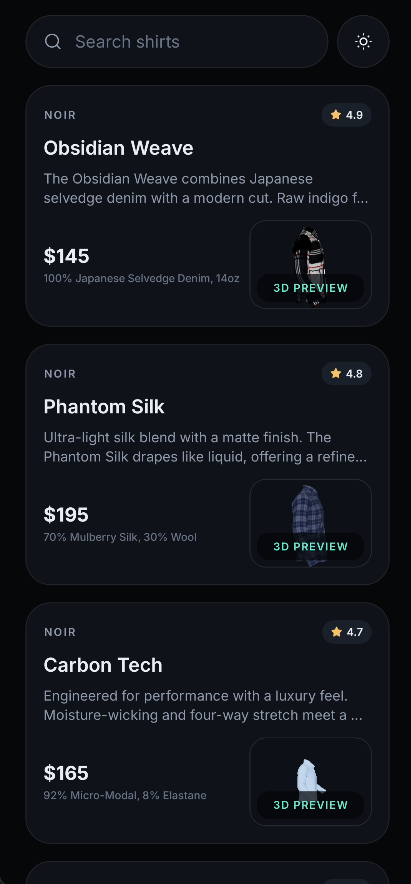
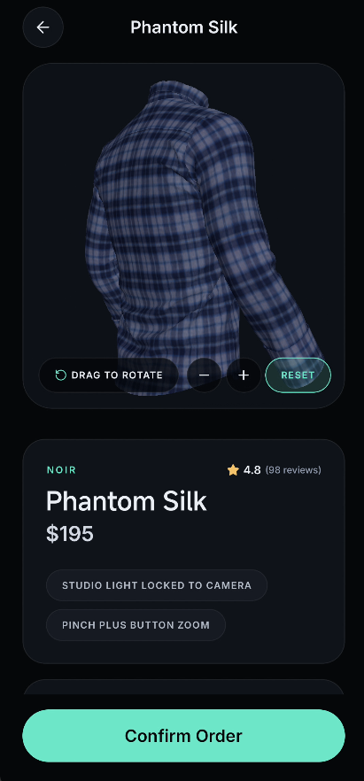
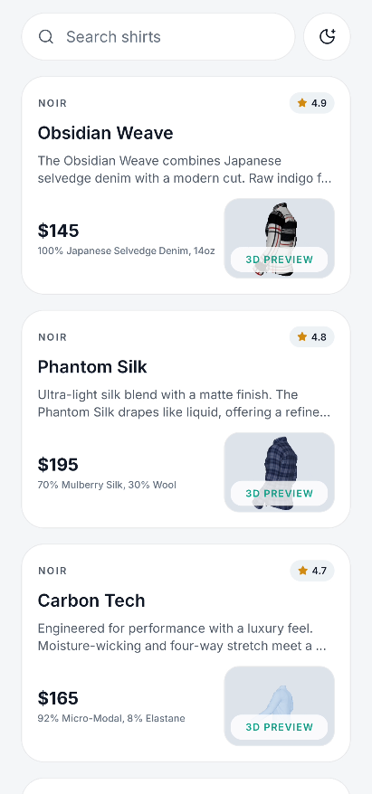
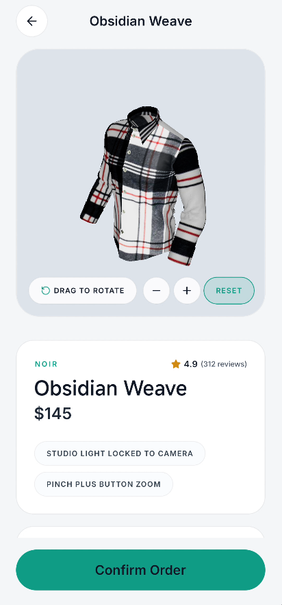

# NOIR Mobile Studio

NOIR Mobile Studio is a demo app built with Expo and React Native that showcases a premium apparel catalog with interactive 3D shirt previews. It combines a polished mobile storefront, theme-aware UI, searchable product cards, and a detailed product view with rotate, zoom, and reset controls for GLB models.

## Features

- Interactive 3D product viewing with Three.js, React Three Fiber, Drei, and Expo GL
- Searchable catalog built with reusable product cards
- Product detail screens with material, maker, rating, reviews, and price information
- Light and dark theme support
- Expo Router navigation for mobile-first product browsing

## Screenshots

| Dark Home | Dark Detail |
| --- | --- |
|  |  |

| Light Home | Light Detail |
| --- | --- |
|  |  |

## Tech Stack

- Expo 54
- React Native 0.81
- Expo Router
- Three.js
- React Three Fiber
- React Native Reanimated

## Run Locally

```bash
npm install
npm run dev
```

Use the Expo development server to open the project on Android, iOS, or web.
